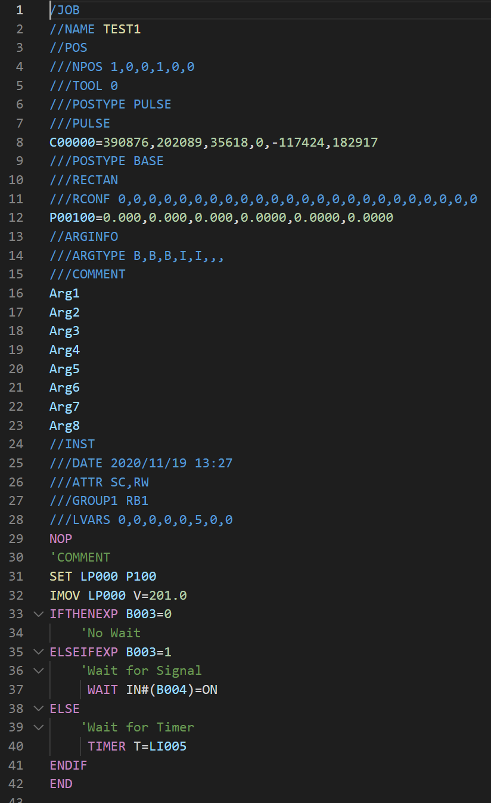

# inform-job-support README

This is the README for vs code extension "YASKAWA Inform Support". 

## Features

This extension support syntax highlight for YASKAWA Motoman Inform language as following image.

## Known Issues

## Release Notes
### [0.5.0]
- Support Folding range for JBI files.
- Support Folding range for PRM files.
- Support Folding range for VAR.DAT file.
- Support Folding range for IONAME.DAT and EXIONAME.DAT.
- Support Folding range for IOMNAME.DAT.
- Support Folding range for other files.

### [0.4.0]
- Support Go to Definiton to C-Var in JBI file.
- Support Hover to show variable number in VAR.DAT.
- Support Hover to show io number in IONAME.DAT and EXIONAME.DAT.
- Support Hover to show register number in IOMNAME.DAT.

### [0.3.0]
- Support Go to Definition to JOB
- Support Go to Definition to LABEL
- Support Hover to show parameter number in .PRM files

### [0.2.0]
- Support syntax highlight for MACRO.DAT
- Update syntax highlight for EXIONAME.DAT

### [0.1.0]
- Support snippets for Inform

### [0.0.4]
Support syntax highlight of following files.
- VAR.DAT
- VARNAME.DAT
- CIOPRG.LST
- IONAME.DAT
- IOMNAME.DAT

Support minimum syntax highlight for other DAT, PRM, CND files.

### [0.0.3]
Add icon in extesion.

### [0.0.1]

Initial release of this extension.

