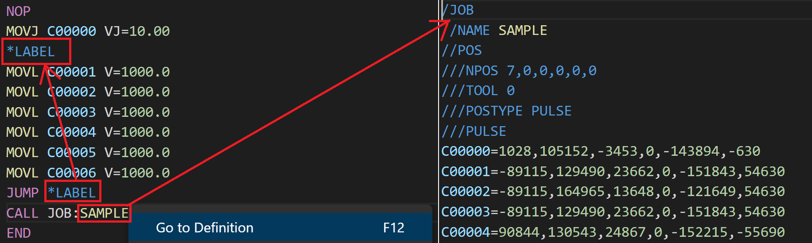
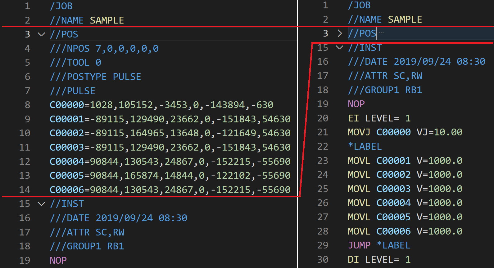
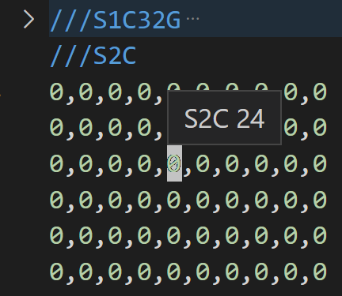
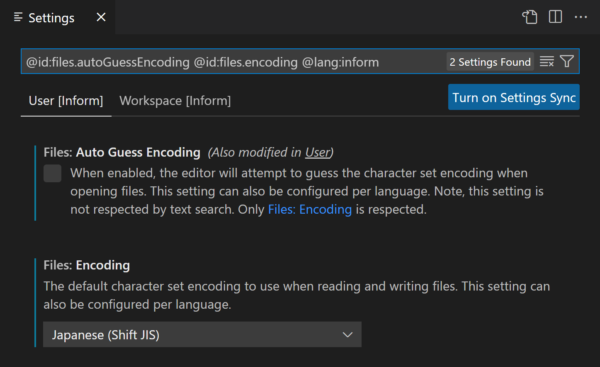

# inform-job-support README

This is the README for vs code extension "YASKAWA Inform Support". 

## Features

### Syntax Highlight
This extension support syntax highlight for YASKAWA Motoman Inform language as following image.


<!-- width: 1099 -->


This extension also support syntax highlight for other inform related files like VAR.DAT, ALL.PRM, and etc.

### Go to Definition
Go to definition to LABEL and JOBNAME is supported.

<!-- width: 1833 -->


### Folding Ranges
Folding range for Inform, and other files is supported.

<!-- width: 1591 -->


### Hover
Hover parameter number in .PRM files.

<!-- widht: 432 -->


## Recommened Setting for Japanese Language User
日本語を使用する場合は、Inform用の言語設定で、「auto guess encoding」をfalseに、「encoding」にshiftjisを設定してください。
これらの設定は、以下で検索できます。
````
@id:files.autoGuessEncoding @id:files.encoding @lang:inform
@id:files.autoGuessEncoding @id:files.encoding @lang:informdat
@id:files.autoGuessEncoding @id:files.encoding @lang:pscfile
````
<!--  widht: 1447 -->



## Known Issues


## Release Notes
### [1.0.0]
- Changed language id

See [CHANGELOG](./CHANGELOG.md) for more informaiton.

